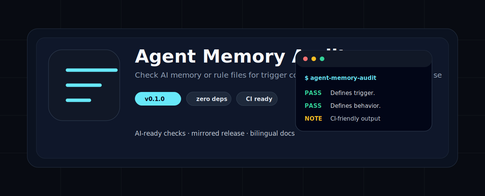
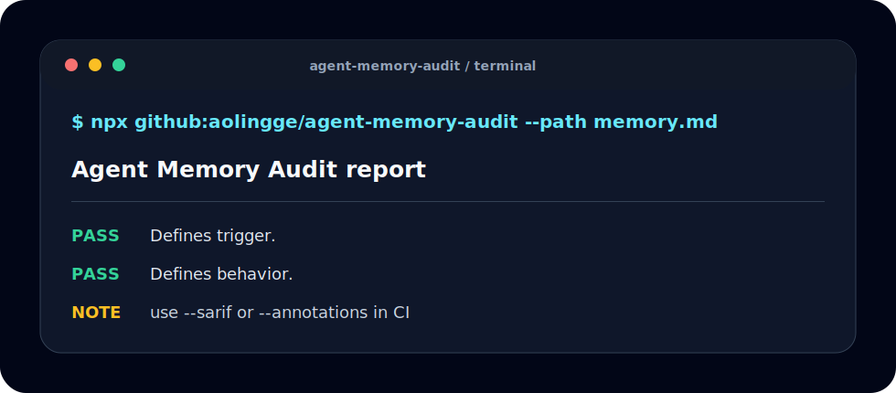

<p align="center">
  
</p>

<h1 align="center">Agent Memory Audit</h1>

<p align="center">检查 AI 记忆/规则文件是否避免保存密钥，并写清触发条件、行为和例外。</p>

<p align="center"><a href="README.md">English</a> · <a href="#quick-start">快速开始</a> · <a href="#checks">检查项</a> · <a href="#ci-usage">CI</a></p>

<p align="center">
  
  
  
</p>

<p align="center">
  
</p>

## 为什么做这个

AI Agent 工具越来越多，但很多仓库缺少能在本地和 CI 里重复执行的小检查。这个工具保持零依赖、可镜像、可复制，适合学生、独立开发者和开源维护者使用。

## Quick Start

```bash
npx github:aolingge/agent-memory-audit --path memory.md
```

```bash
npx github:aolingge/agent-memory-audit --path memory.md --markdown > report.md
npx github:aolingge/agent-memory-audit --path memory.md --sarif > results.sarif
npx github:aolingge/agent-memory-audit --path memory.md --annotations
```

## Checks

| Check | What it looks for |
| --- | --- |
| trigger | Defines trigger. |
| behavior | Defines behavior. |
| exception | Defines exceptions. |
| secret | Blocks secrets. |

## CI Usage

See [docs/github-actions.md](docs/github-actions.md) and [docs/quality-gates.md](docs/quality-gates.md).

## Mirrors

- GitHub: https://github.com/aolingge/agent-memory-audit
- Gitee: https://gitee.com/aolingge/agent-memory-audit

## Contributing

Good first PRs: add checks, add fixtures, improve docs, or add GitHub Actions examples.

## License

MIT
